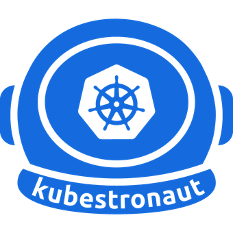
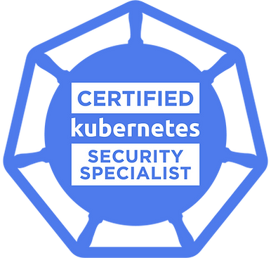
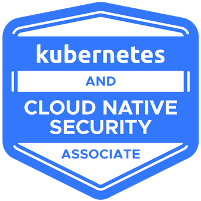
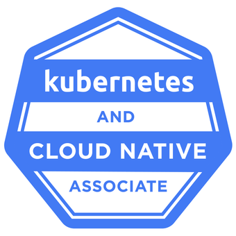
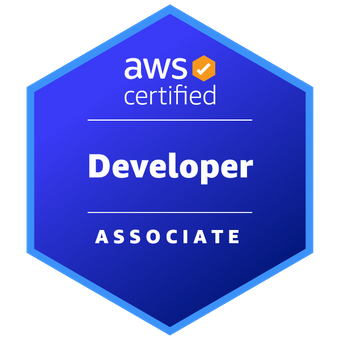
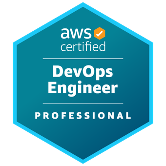
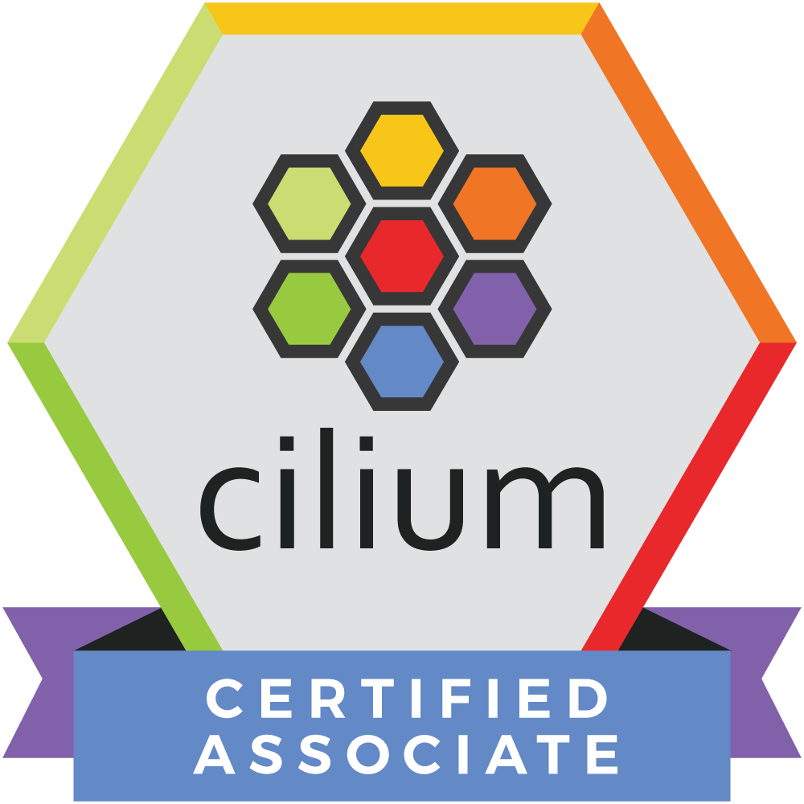
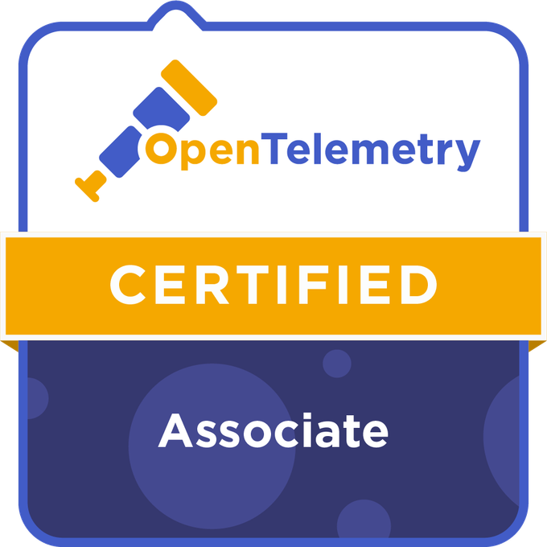
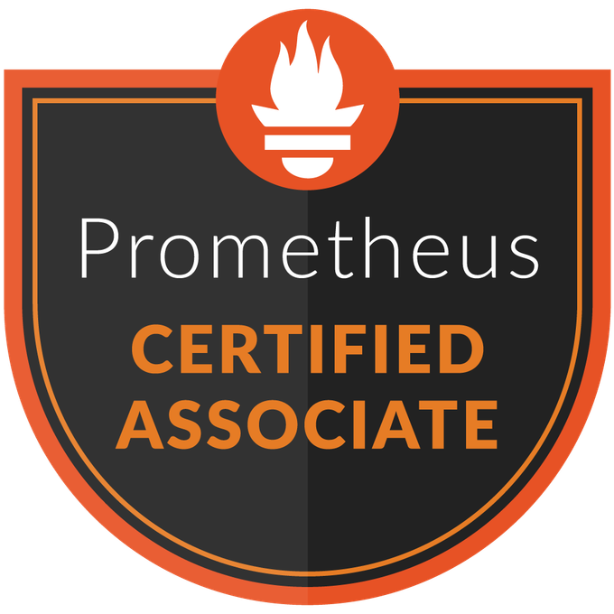

- 👋 Hi, I’m @sjoukedv
- 👀 I’m interested in Kubernetes, Terraform, Argo CD, and DevOps in general
- 🌱 I’m have a MSc in Computing Science Distributed Systems and Software Engineering, and hold the certifications below.
- 💞️ I’m looking to collaborate on freelance projects and contirbutions to open-source projects
- 📫 You can reach me via info@sdvservices.nl

